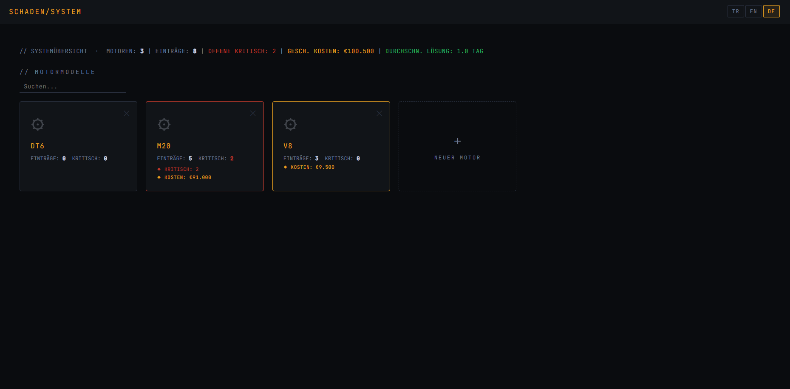
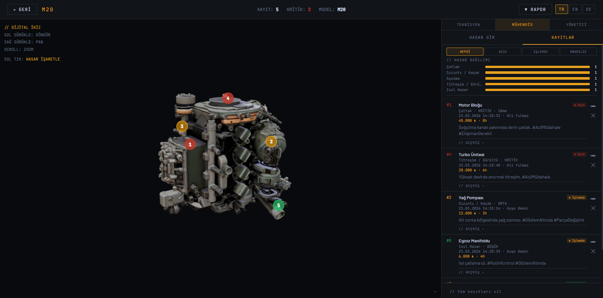
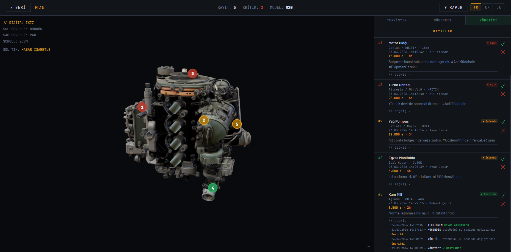
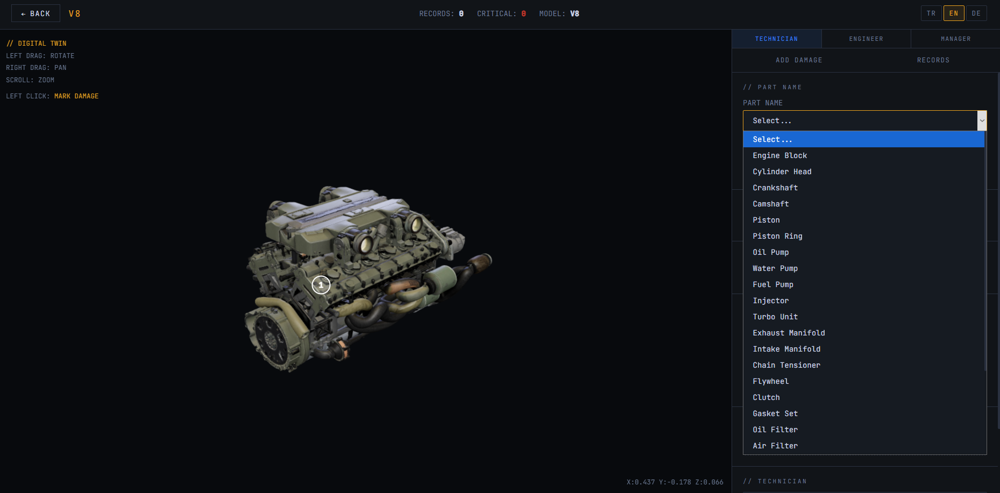
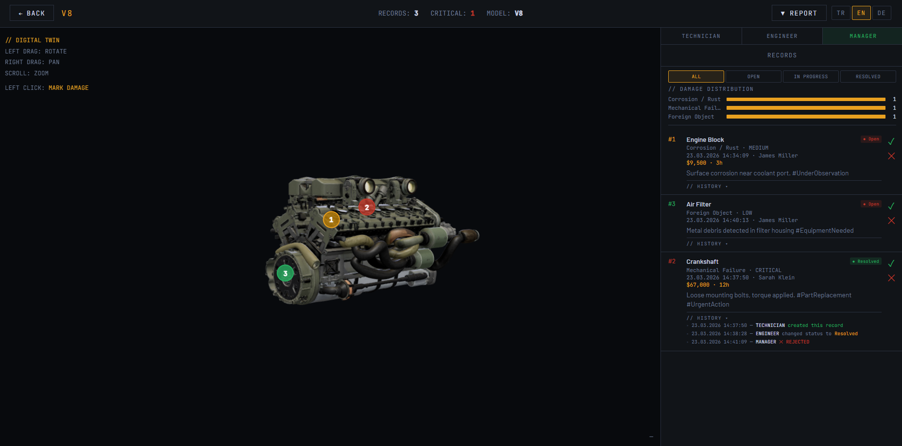
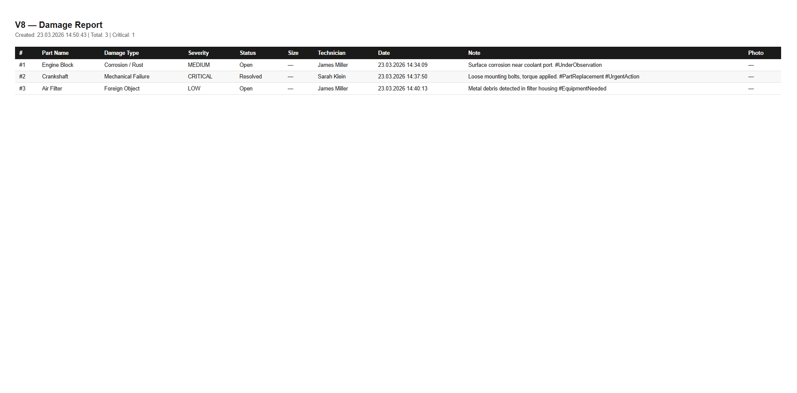

# Motor Damage Inspection System

> Browser-based 3D digital twin for industrial motor damage inspection, reporting, and maintenance management.

**[🔗 Live Demo](https://lewla-u.github.io/motor-damage-inspection-system/)**

---

## Overview

A full-featured CMMS (Computerized Maintenance Management System) that runs entirely in the browser. Technicians, engineers, and managers can annotate damage directly on a 3D model, track repair workflows, analyze KPIs, and export standardized reports — all without any backend or database.

---

## Screenshots

| | |
|---|---|
|  |  |
|  |  |
|  |  |

---

## Features

### 3D Digital Twin
- Load and inspect `.glb` motor models directly in the browser
- Click anywhere on the 3D model to place a damage annotation pin
- Pins are occluded correctly — hidden when behind the model

### Role-Based Access Control (RBAC)
| Role | Permissions |
|------|-------------|
| **Technician** | Create records, upload photos, set status to Open / In Progress |
| **Engineer** | Edit cost & hours on technician records, set all statuses, view damage distribution chart |
| **Manager** | Approve / reject records, export reports, view KPI dashboard |

### Audit Log
Every status change, approval, or update is logged with timestamp and role — full traceability per record.

### KPI Dashboard
- **MTTR** — Mean Time to Resolve (days)
- **Pending Repair Cost** — sum of unresolved record costs
- **Open Critical** — count of unresolved critical severity records
- **Damage Distribution** — bar chart by damage type (Engineer / Manager only)

### Predictive Maintenance
Rule-based suggestions trigger automatically when a damage type is selected — referencing part IDs and recommending inspection steps.

### Mock ERP / Spare Parts Integration
Simulates SAP-style inventory lookup — shows stock availability and lead times for recommended parts.

### Multilingual Support
Full UI translation across **Turkish / English / German** including:
- All form labels, status badges, and system messages
- Damage type dropdown (language-aware)
- Part name dropdown (language-aware)
- Currency formatting by locale (₺ / $ / €)

### Export
- **PDF** — formatted damage report in the active UI language
- **JSON** — structured export with schema versioning, English-normalized field values

---

## Tech Stack

| Technology | Usage |
|-----------|-------|
| Three.js | 3D model rendering, raycasting, pin projection |
| Vanilla JavaScript | Application logic, state management |
| HTML / CSS | UI layout and styling |

---

## Local Development

```bash
# Clone the repo
git clone https://github.com/lewla-u/motor-damage-inspection-system.git
cd motor-damage-inspection-system
```

Open `index.html` directly in the browser — no server needed.

> On GitHub Pages the live demo works out of the box.

---

## Project Structure

```
├── index.html          # Main application
├── models.json         # GLB model list
├── models/
│   ├── m20.glb
│   ├── v8.glb
│   └── dt6.glb
└── screenshots/
```

---

## Author

**Leyla Nur Uğur**
3rd-year MIS(German) student at Marmara University
[github.com/lewla-u](https://github.com/lewla-u)
